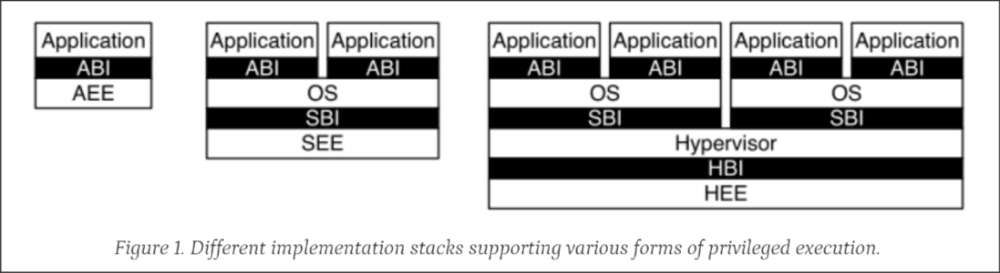
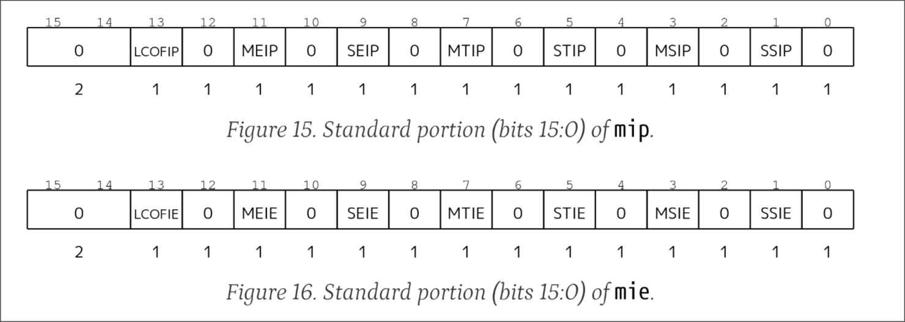

# Port-Linux-on-NEMU

## About

这篇文章是从笔者的笔记整理而来, 比起“讲义”更像“博客” ,目前有许多东西都还没有完善(特别是linux driver的部分)

在笔者尝试给`NEMU`移植`kernel`的时候, 感到完全无从下手(也没发现`CommandBlock`老师的教程),过程中踩了非常多的坑,于是总结了这篇笔记

虽然大家更加建议的`roadmap`是`PA3,4->xv6->quardstar->linux-nommu->linux-mmu`,但笔者觉得,如果我们给`NEMU`加上了完备的基础设施(`difftest/trace/gdb`),`NEMU`比`QEMU`更能帮助我们理解`kernel`启动的流程,完全可以`PA3,4->(xv6->)linux-mmu`

也可以参考
- [`CommandBlock老师的教程`](https://github.com/CmdBlockZQG/rvcore-mini-linux)
- [`quand_star 进阶`](https://github.com/arch-simulator-sig/quard-star-tutorial-2021)

## Proposal: Let's build this Document together!🚀

发现问题/有好的建议欢迎提PR!

PR is always welcome here.

### 打开方式

建议先完成:
- `NEMU PA` 全部内容
- 阅读`Opensbi`和`RISCV Spec Volume II, ch 1,2,3,10`

由于笔者的NEMU的架构是`riscv32`,这篇文章的很多Tips可能只适合与`riscv32`架构,但是从生态的角度来讲,`riscv64gc`的生态会非常好,建议大家优先考虑实现`riscv64gc`

如果`NEMU`实现的足够优雅是可以通过`menuconfig`来切换`rv32`/`rv64`,但显然我没有😭

#### 启动`linux kernel` 和启动`nanos-lite`的区别

- `Nanos-lite`的实现不是很规范,比如在`M-mod`下启用虚拟内存,也没有实现`S-Mod`
- 从硬件(`NEMU`)的角度来说,Linux的规模更大,如果实现有问题更能体现出来
- `Nanos-lite`是我们自己写硬件+软件,如果硬件有BUG可以在软件上加一个workaround()

## 启动 `linux kernel` 的多种方式

- `fsbl->opensbi->linux`
- `fsbl->opensbi->u-boot->linux`
- `uboot-spl->opensbi->u-boot->linux`

在 nemu 上都不用实现 fsbl, 所以可以选择最简单的方法: `opensbi->linux`

> 可以参考 `Opensbi repo`里面的 `fpga/arine`

### About OpenSBI

> "硅基大陆的宪法仍在，城邦却铸造着各自的货币"

提供标准SBI接口、隔离硬件访问

1.虽然有统一的标准, 但是不同`RISC-V`硬件实现的差异还是太多了, 比如用多少个 `pmp` 寄存器, 相关硬件的早期初始化都不一样, `opensbi`就是负责启动早期的工作的

2.抽象和安全
当计算机世界一个东西变得足够复杂的时候, 就创建一个抽象层来简化它

所以启动带 mmu 的 `kernel` 一定要用 `opensbi`



1. A platform-specific firmware running in M-mode and a bootloader, a hypervisor or a general-purpose OS executing in S-mode or HS-mode.
2. A hypervisor running in HS-mode and a bootloader or a general-purpose OS executing in VS-mode.

### 所以 uboot 是干什么的?

我的理解:更高级的支持->支持命令行/从 `tftp` 服务器上下载文件, 更复杂的硬件和安全支持.
但显然目前在 `nemu/npc` 上不需要

### Opensbi 的多种模式

- `FW_PAYLOAD` 把下一个阶段的内容直接打包进 `opensbi` 生成的 `binary` 里面
- `FW_JUMP` 直接跳转到一个固定的地址
- `FW_DYNAMIC` 从上一个 booting-stage 获取信息 (比如上一个 stage 已经把 `opensbi` 和系统准备好了)

在 `nemu` 上用 ` FW_PAYLOAD ` 是最省力的

## 阅读手册

为啥不去看看 rv 手册呢 (Volume II, ch 1,2,3,10)

- `(Reserved Writes Preserve Values, Reads Ignore Value)WPRI`
- `(Write/Read Only Legal Values)WLRL`
- `(Write Any Values, Reads Legal Values)WARL`

Opensbi 在启动的过程中就会尝试给很多 csr 寄存器写数值, 然后再读取出来, 
- 如果寄存器没有实现, 就会抛出 `illegal instruction fault`, 这时候跳转到 `Opensbi` 自己的异常处理程序里面, 如果这个 csr 是必须的, 那么 opensbi 会抛一个异常停下来, 如果不是必须的, 那么接下来就不使用这个寄存器继续
- 如果硬件某些寄存器的位没有实现, Opensbi 会不使用这个位

`csr` 寄存器可以通过索引的高四位判断权限/RW 权限等等->硬件实现就简单了

`mstatus/sstatus` & `sie/mie` 的某些位应该是硬件上的相同 bit, 根据手册定义
 
```
A restricted view of mstatus appears as the sstatus register in the S-level ISA.
```

### 思考: 我们需要实现哪些 `csr`?

如果目标仅仅是<我要把 `kernel` 正常跑起来>的话

- 首先排除所有拓展
- 排除和安全相关的 `csr`
- 其实可以直接启动 `opensbi-FW_JUMP` 模式, 把 `opensbi` 的输出调好, 只要能正常跑到跳转的地方就说明 `csr` 已经实现的差不多了

## 更强的基础设施

### 实现 `difftest`

#### 阅读 `Spike` 源码

重要的文件
- `processor.h/state_t`：里面包含了 spike 的状态 (全部的寄存器)
- `../difftest.cc/difftest_init`: 里面包含了 spike 的初始化参数->只实例化 16 个 `pmpregions`
- `csrs.cc`：里面有各种 csr 寄存器的行为

##### 比较有意思的事情

- 取指的时候先 fetch->dedode->放进 icache 里面, 利用程序的局部性来实现加速.
- Decode 使用了查找表
- 对于各种异常(非法指令,page fault)等使用了try-catch处理
- 某些寄存器的一些位没有完全实现,对这些寄存器的读写有 MASK (在 `csrrs.cc` 中)
- 指令的实现在 `riscv/insns/*.h` 中

#### 对访问不存在的csr寄存器的时候

回想起之前手册的内容, 访问没有实现的 CSR 寄存器的时候会抛出 Illegal Instruction Fault,

我们有很多方法来处理
- 和访问设备的处理方式一样,把nemu的寄存器复制进Spike,但这样不太好
- 让Spike在访问nemu未实现的寄存器的时候同步抛一个`illegal instruction fault`

那么我们就需要修改Spike的代码了

在spike中,所有 csr 指令都会首先 `get_csr`, 如果 csr 不存在就抛异常, 所以只要在不打算实现的 csr 上抛出一个异常就行了

```c
bool difftest_dut_csr_notexist = false;

// Note that get_csr is sometimes called when read side-effects should not
// be actioned.  In other words, Spike cannot currently support CSRs with
// side effects on reads.
reg_t processor_t::get_csr(int which, insn_t insn, bool write, bool peek)
{
  if(difftest_dut_csr_notexist) {
    difftest_dut_csr_notexist=false;
    printf("spike:stepping DUT(nemu,npc)'s unimplemented csr\n");
    throw trap_illegal_instruction(insn.bits());
  }
  auto search = state.csrmap.find(which);
  if (search != state.csrmap.end()) {
    if (!peek)
      search->second->verify_permissions(insn, write);
    return search->second->read();
  }
  printf("spike:stepping REF(spike)'s unimplemented csr\n");
  // If we get here, the CSR doesn't exist.  Unimplemented CSRs always throw
  // illegal-instruction exceptions, not virtual-instruction exceptions.
  throw trap_illegal_instruction(insn.bits());
}
```

##### WARN: 不要使用 `ref_difftest_raise_intr`来实现上述功能

`ref_difftest_raise_intr`是用来实现中断的,只会设置异常号跳转到异常处理程序

但是`illegal instruction fault`存在"副作用",会对多个csr寄存器做修改,所以**不要使用下面的方案**
```c
//不要使用下面的方案!
void difftest_step_raise(uint64_t NO) {
//step
  ref_difftest_exec(1);
//rasie intr
  ref_difftest_raise_intr(NO);
//set step
  difftest_skip_ref();
  ref_difftest_regcpy(&cpu, DIFFTEST_TO_REF);
}
```

#### 实现 `difftest_csr`

- 修改 `difftest_init` 的 api, 传入需要 diff 的 csr 的索引数组
- 每次diff的时候只传输需要diff的csr
- 借助宏定义,就可以实现在nemu实现一个csr的同时自动给这个csr做diff
- 宏真好用 ()

### 接入 gdb

使用[`mini-gdbstub`](https://github.com/RinHizakura/mini-gdbstub)项目可以很轻松在`nemu`里面接入`gdb-server`

#### 有待解决的问题

如果仔细测试`mini-gdbstub`的实现,你会发现虽然`mini-gdbstub`虽然实现了`stepi`函数,但gdb并不会调用它!gdb的每次step都是在下一条指令的位置打一个断点,然后`continue`,这会导致对`ecall``step`的话有问题,无法step进异常处理程序.

猜测是init的时候给gdb传的参数有问题.

#### 进阶操作

##### 给`gdb`传送`target description`文件来实现对csr的读取

具体参考往期分享会

##### 结合`tmux`实现自动分屏

`tmux split-window -h -p 65 "riscv64-unknown-linux-gnu-gdb -ex \"target remote localhost:1234\" $(ELF)"`

##### 自动读取符号表

`ELFS :='-ex \"set confirm off\" -ex \"symbol-file ${PWD}/opensbi/build/platform/nemu/firmware/fw_payload.elf\" -ex \"add-symbol-file ${PWD}/linux/vmlinux\" -ex \"set confirm on\"'`

##### 使用`socket`加速

参考该项目[`github pr#5`](https://github.com/RinHizakura/mini-gdbstub/pull/5)

### 添加trace

为了更加深入理解`linux kernel`的行为,可以考虑添加:
- 异常/中断的`trace`
- 设备(`PLIC`)的`trace`
- `MMU`的`trace`
- `ecall`的`trace`

## 我自己的技术选型

**非常不建议完全按照我的方法走!**

一开始在感觉*给 `NEMU` “移植” ` linux ` 的过程中用`NEMU`来模拟硬件的行为是不是怪怪的*
所以我选择了不改动 `nemu` 的实现 (比如 ` uart `) ,而是给 `opensbi` / `linux` 写驱动 (但这样会花很多时间)

~~然后写 `linux-uart` 驱动的时候发现自己小看了 `linux kernel` 的复杂程度 (:-~~

其实 nemu 的 uart 可以轻松修改兼容标准的`UART16550`,具体`RTFSC`.

## 移植 `Opensbi` 

主要参考了 `opensbi/docs/platform_guide.md` ,但是,如果 `nemu` 模拟了 `UART16550` 的话, 其实更推荐使用 Opensbi 官方提供的 [`Generic Platform`](https://github.com/riscv-software-src/opensbi/blob/master/docs/platform/generic.md) ,根据官网介绍可以直接按照设备树来自行加载驱动

### 创建一个新的 platform

从 `platform/template` 里面复制然后稍作修改

### 设置 `Makefile` 的参数

```Makefile
PLATFORM_RISCV_XLEN = 32
PLATFORM_RISCV_ABI = ilp32
PLATFORM_RISCV_ISA = rv32ima_zicsr_zifencei
PLATFORM_RISCV_CODE_MODEL = medany

FW_DYNAMIC=n

FW_JUMP=y
FW_TEXT_START=0x80000000
FW_JUMP_ADDR=0x0
```

这里可以先使用`JUMP`模式,把 `FW_JUMP_ADDR` 设置成 0, 如果执行 `mret` 之后跳转到了 0 就说明 ` opensbi ` 执行完了,后续我们跑linux的时候再使用`PAYLOAD`模式。

你接下来需要在开启difftest的情况下正常跑到`mret`的地方.

编译:

```
make CROSS_COMPILE=riscv64-unknown-linux-gnu- PLATFORM=nemu
```

生成的二进制文件: `./build/platform/nemu/firmware/fw_jump.bin`

>后续开启PAYLOAD以后二进制文件就是`fw_payload.bin`了

### 让 `opensbi` 正常输出字符 (适配 `nemu-uart` )

主要参考 `int uart8250_init(unsigned long base, u32 in_freq, u32 baudrate, u32 reg_shift,u32 reg_width, u32 reg_offset)` 这个函数的代码, 主要要调用 `sbi_console_set_device` `sbi_domain_root_add_memrange` 这两个函数, 然后自己实现一个 `nemu-uart` 的驱动, 这样就能看到字符的正常输出了

```c
static int uart_getch(void)
{
	return -1;
}
static void uart_putch(char ch)
{
	char *serial_base = (char *)0xa0000000 + 0x00003f8;
	*serial_base	  = ch;
}

static struct sbi_console_device my_uart = { .name	   = "nemu_uart",
					     .console_putc = uart_putch,
					     .console_getc = uart_getch };

/*
 * Platform early initialization.
 */
static int platform_early_init(bool cold_boot)
{
	if (!cold_boot)
		return 0;

	sbi_console_set_device(&my_uart);
	return sbi_domain_root_add_memrange(0x10000000, PAGE_SIZE, PAGE_SIZE,
					    (SBI_DOMAIN_MEMREGION_MMIO |
					    SBI_DOMAIN_MEMREGION_SHARED_SURW_MRW));
	return 0;
}
```

如果实现比较正常, 那么你应该能看见输出信息 (要么是 `Opensbi` 的欢迎界面, 要么是 `Opensbi` 报错某个寄存器没有实现)

```
system_opcode_insn: Failed to access CSR 0x104 from M-mode
sbi_trap_error: hart0: trap0: illegal instruction handler failed (error -1)
```

### 阅读 `Opensbi` 的源码

如果提前看了 opensbi 的汇编代码, 会发现 `csr_read_num` 等函数里面有很多 `csr` 寄存器, 但其实不一定都要实现

这是因为:在启动过程中,Opensbi会先注册一个特殊的中断处理程序,然后对很多个寄存器尝试写入,如果这个寄存器硬件没有实现,那么就会跳转到它的中断处理程序里面,如果这个寄存器是必须的,那Opensbi就会抛出一个异常,如果是可选实现,那么就会继续执行,并在之后不使用这个寄存器

可以参考下面的代码:
- `sbi_csr_detect.h/csr_read_allowed//csr_write_allowed` 检测寄存器是否支持读写!
- `sbi_hart` 里面 `hart_detect_features` 会检测平台支持的寄存器是否存在等, 它包括异常处理, 允许后续恢复现场

### 向 `nemu` 添加更多的寄存器

我不选择"一口气把所有手册中定义的 csr 全部实现"因为感觉会陷入名为<细节>的黑洞:要实现很多非必须的csr的功能

听北京基地的某位大佬说香山的 `nemu` 的 `csr` 实现的非常巧妙, 感兴趣可以参考, 但我没看 (:-

#### 宏魔法

在实现过程中可能要频繁修改 `csr` 寄存器的列表, 我希望通过宏定义实现相对统一的寄存器管理: 在头文件中添加了一个寄存器之后：
- 自动为寄存器的索引生成一个常量
- `Difftest` 的时候会自动比较这个寄存器
- `gdb/sdb` 能读取/显示/打断点这个寄存器
所以我使用了 `define` 和 `undef` 组合, 让一个宏有多种展开方式

```c
#define CSR_LIST \
  GenCSR(MHARTID, 0xf14) \
  GenCSR(MSTATUS, 0x300) \
  ...
  
  #define GenCSR(name, paddr) \
  static const uint32_t NEMU_CSR_V_##name = paddr; \
  static const uint32_t NEMU_CSR_##name = paddr;
	CSR_LIST
  #undef GenCSR
...
  static const char *difftest_csr_name[] = {
#define GenCSR(NAME,IDX) #NAME,
  CSR_DIFF_LIST
#undef GenCSR
};
...

#define GenCSR(name, paddr) \
  "<reg name=\"" #name "\" bitsize=\"32\" type=\"int\" regnum=\"" #paddr "\" />\n"
  ...
  
```

#### 位域

```c
typedef union {
  struct {
    unsigned int       : 1;
    unsigned int SSIE  : 1;
    unsigned int       : 1;
    unsigned int MSIE  : 1;
    unsigned int       : 1;
    unsigned int STIE  : 1;
    unsigned int       : 1;
    unsigned int MTIE  : 1;
    unsigned int       : 1;
    unsigned int SEIE  : 1;
    unsigned int       : 1;
    unsigned int MEIE  : 1;
    unsigned int       : 1;
    unsigned int LCOFIE: 1;
    unsigned int       : 18;
  } bits;
  uint32_t value;
} mie_t;
#define NEMU_mie ((mie_t *)(&cpu.csr[NEMU_CSR_MIE]))

//使用
NEMU_mie->bits.STIE = xxx;
NEMU_mie->value = xxx;
```

当然这种写法有问题(Unspecified behavior(参考标准附录J)),根据标准定义,struct中的bit-filed必须被打包进同一可寻址单元的相邻域中(如果大小合适)但是,
- 同一单元之中的位域分配顺序(从高到低还是从低到高,由实现来决定)
- 跨单元的行为由实现来决定

> (From `ISO/IEC 9899:2024 6.7.3.2.13`)
> An implementation may allocate any addressable storage unit large enough to hold a bit-field. If
enough space remains, a bit-field that immediately follows another bit-field in a structure shall be
packed into adjacent bits of the same unit. If insufficient space remains, whether a bit-field that
does not fit is put into the next unit or overlaps adjacent units is implementation-defined. The
order of allocation of bit-fields within a unit (high-order to low-order or low-order to high-order) is
implementation-defined. The alignment of the addressable storage unit is unspecified.

#### 寄存器的细节

指令运行执行过程中**当前正在执行的指令直接触发**的异常一般是**同步异常（Synchronous Exception）**, 要立刻阻塞当前的指令执行流, 并且指令本身不应该产生其他的副作用。

所以`word_t isa_raise_intr(word_t NO, vaddr_t epc)` didn't work!
当然我们可以用一个参数来表示是否成功, 但是,考虑这一个指令
`INSTPAT("??????? ????? ????? 001 ????? 11100 11", csrrw , I, R(rd)=CSRR(imm&0xfff,s);CSRW(imm&0xfff,s)=src1);`

可能会发生什么呢?
- 访问的 csr 不存在, 抛出 illegal instruction fault
- 没有权限访问 csr, 抛出 illegal instruction fault
- 取指过程中出现 page fault, 抛出Instruction page fault
对于 L/S, 还可能会抛出 `Load page fault` / `Store/AMO page fault`

这么多不同的地方会抛出这么多不同的错误, 这也太不"优雅"了!
所以 Spike 选择用 try-catch, 但是我们的 c 没有😭

回忆 15-213 ,老师似乎讲过一个 none-local-jump 的东西, 允许程序直接从一个很深的调用栈里面直接跳出跳转到某个位置, 查询资料, 找到了 `set-jump` 函数, 虽然有性能的损失,但也能满足我们的需求。

```c
int isa_exec_once(Decode *s) {
  int jump_value = setjmp(memerr_jump_buffer);
  if(jump_value!=0){
    return exception_exec(jump_value,s);
  }
  ...
}
```

## 向LinuxKernel进发!

在[`kernel.org`](https://www.kernel.org/)下载linux内核源码

可以大致读一下[`Linux的启动流程`](https://en.wikipedia.org/wiki/Booting_process_of_Linux)

> linux 内核 `6.x` 开始 `menuconfig` 默认不显示 `riscv32`的编译选项了,需要勾选(Allow configurations that result in non-portable kernels),我拉取5.15的版本

### 配置kernel

建议先从 `defconfig` 改动, 而不是 `tinyconfig` 改动, 先把 `kernel` 跑起来再说

虽然提供了具体的配置方案,但还是建议大家自己好好看看kernel 有哪些配制
`make ARCH=riscv CROSS_COMPILE=riscv32-unknown-linux-gnu- (defconfig/menuconfig/tinyconfig)`

#### 基于`defconfig`的参考配置方案

```
//设置initramfs的文件((可以先不填)如果不填kernel会默认拿一个空文件)
→ General setup->Initial RAM filesystem and RAM disk (initramfs/initrd) support(填自己的Initramfs source file(s))
→ Platform type ->Base ISA (RV32I)
//关闭了这个才能关闭compressed instructions
→ Boot options -> UEFI runtime support (n)
→ Platform type->Emit compressed instructions when building Linux  (n)
→ Platform type->FPU support(n)
→ Device Drivers → Character devices → Serial drivers -> NEMU uartlite serial port support (y)(自己写的驱动)
//在vmlinux里面加入调试信息,提升调试体验
→ Kernel hacking → Compile-time checks and compiler options->Compile the kernel with debug info (y)
```

#### 还是想从`tinyconfig`开始修改?

- 你需要尽量启用完整的debug支持,特别是`earlycon`,`printk`
- 你需要启用`uart`和`plic`的驱动

##### 我们最小需要什么?

- 串口输出支持
- 中断支持(for `uart` 输入)
- 一些debug支持(`printk`,`early-console`等)
- Riscv32IMA架构

##### 一个基于`tinyconfig`实现最小化配制的参考方案

```
//启用printk的支持(用于打印log)
→ General setup → Configure standard kernel features (expert users) -> Enable support for printk(y)
//启用并选择一个initramfs的内核文件 
→ General setup->Initial RAM filesystem and RAM disk (initramfs/initrd) support(y)(填自己的Initramfs source file(s))
→ Platform type ->Base ISA (RV32I)
→ Boot options -> UEFI runtime support (n)
→ Platform type->Emit compressed instructions when building Linux  (n)
→ Kernel hacking → printk and dmesg options->Show timing information on printks 
→ Kernel hacking → Compile-time checks and compiler options -> Compile the kernel with debug info (y)
→ Device Drivers → Character devices ->Enable TTY (y)
→ Device Drivers → Character devices ->Enable TTY -> Early console using RISC-V SBI (y)
→ Device Drivers → Character devices ->Enable TTY ->  NEMU uartlite serial port support (y)   
→ Executable file formats->Kernel support for scripts starting with #! (y)
→ Device Drivers → IRQ chip support->SiFive Platform-Level Interrupt Controller (y)
```

### `linux kernel`的打开方式

#### 基础设施

- 可以配置一个好用的`clangd`,支持代码跳转/宏展开等功能
- NEMU接入gdb,边调试边理解
- 觉得每次传参数太麻烦了?->写一个Makefile!
- 让gdb可以调试Spike的代码->默认情况下,直接使用gdb是无法调试作为difftest-ref的spike的,这是因为在`nemu/tools/spike-diff/Makefile`里面有一个替换指令`sed -i -e 's/-g -O2/-O2/' $@`

### 编译`kernel`

`make ARCH=riscv CROSS_COMPILE=riscv32-unknown-linux-gnu- -j $(nproc)`

会编译出:
- `./vmlinux` `kernel`的elf文件
- `./arch/riscv/boot/Image`二进制文件,作为`Opensbi`的payload

### 来自虚拟内存的问候NO.1

将软件TLB(Translation Lookaside Buffer)填充设置为可选项->在nemu中为了简化就可以不实现TLB了

> The initial RISC-V paged virtual-memory architectures have been designed as
straightforward implementations to support existing operating systems. We have
architected page table layouts to support a hardware page-table walker. Software TLB
refills are a performance bottleneck on high-performance systems, and are especially
troublesome with decoupled specialized coprocessors. An implementation can
choose to implement software TLB refills using a machine-mode trap handler as an
extension to M-mode.

### 来自虚拟内存的问候NO.1

如果你在这时候使用`objdump`尝试反编译`vmlinux`的内容,你会发现`kernel`被链接到了`0xC0000000`的位置,这和我们将要把代码放置的位置不同!
先别急,这是正常现象,如果你的`riscv`模拟器实现正确,`kernel`完全可以正常运行
为什么?不妨加一个trace自行探索试试看?

>hint:linux内核中异常!=错误,只有无法处理的异常==错误

### 统计 kernel 需要多少 csr

为啥不先看看 `kernel` 访问了那些寄存器呢?

但注意:有一个 time (timeh) 寄存器反汇编出来的指令是 rdtime/rdtimeh


首先 Objdump 出 `vmlinux` 的内容, 然后可以写一个简单的 Python 脚本来统计总共访问了哪些 csr 寄存器

```python
import re
import sys

def find_csr_registers(disassembly):
    csr_pattern = re.compile(r'.*csr[a-z]{1,2}\t.*')
    csrr_pattern = re.compile(r'.*csrr\t.*')
    csr_registers = set()

    for line in disassembly.split('\n'):
        match = csr_pattern.search(line)
        csrr_match = csrr_pattern.search(line)
        if csrr_match:
            result=re.split(r'[,\t]+',line)[-1]
            csr_registers.add(result)
        elif match:
            result=re.split(r'[,\t]+',line)[-2]
            csr_registers.add(result)

    return sorted(csr_registers)

if __name__ == "__main__":

    with open("./result.txt", 'r') as f:
        disassembly = f.read()

    csr_list = find_csr_registers(disassembly)

    print("Used CSR registers:")
    for csr in csr_list:
        print(f"- {csr}")
```

#### 来自真实系统的 tradeoff

在真实的系统中, 时钟一般不会设计成一个寄存器/csr 的形式, 因为会有多个 hart 同步/关机/动态调频的问题, 一般设计成 MMIO

来自 riscv-spec
> Accurate real-time clocks (RTCs) are relatively expensive to provide (requiring a crystal or
MEMS oscillator) and have to run even when the rest of system is powered down, and so
there is usually only one in a system located in a different frequency/voltage domain from
the processors. Hence, the RTC must be shared by all the harts in a system and accesses to
the RTC will potentially incur the penalty of a voltage-level-shifter and clock-domain
crossing. It is thus more natural to expose mtime as a memory-mapped register than as a
CSR.

### 再次提醒:基础设施

`kernel` 的报错输出依赖关键csr寄存器的实现正确,但是csr实现的细节很繁杂,没有difftest的话很可能会存在某些地方实现错误!

#### gdb大法好

gdb可以极大地加强你的调试体验,你不会喜欢一直使用printk调试法/ebreak调试法的

~~ebrak调试大法~~(别学)

```c
asm volatile (
    "mv a0, %0\n\t"    // 将 start 的值加载到 a0 寄存器
    "mv a1, %1\n\t"    // 将 end 的值加载到 a1 寄存器
    "ebreak"           // 执行 ebreak 指令
    :
    : "r"(start), "r"(end) // 输入操作数：将 start 和 end 传递给寄存器
    : "a0", "a1"       // 声明 a0 和 a1 寄存器会被修改
);
```

gdb好用的地方之一:可以读取函数调用的`backtrace`和参数,如果你的earlycon输出不正常也可以使用gdb来调试

```
#2  0x8091d2d8 in panic (fmt=fmt@entry=0x81410b78 <payload_bin+12651384> "\0014RISC-V system with no 'timebase-frequency' in DTS\n")
    at kernel/panic.c:443
```

##### 检查编译内核的时候是否添加了调试新息

```
→ Kernel hacking → Compile-time checks and compiler options -> Compile the kernel with debug info 
```

打开这个选项以后gdb的调试体验会极大增强(可以读函数参数,可以对着源代码调试)

#### 来自虚拟内存的问候NO.1

`kernel`启动早期会开启MMU,MMU的实现会导致gdb远程调试出现bug(无法正确扫描内存导致`info src`出现异常),所以需要特殊处理,有两个方法:
- 在gdb扫描内存的时候执行`page table walk`
- (不推荐,地址有问题可能会触发`kernel`的`BUG_ON`宏或者导致设备树读取失败)修改`linux kernel`的`Makefile`,把`PAGE_OFFSET`设置成和加载地址一样的数值,这样可以保证kernel的虚拟地址和物理地址相等

#### 测试你的基础设施

用gdb远程调试给`kernel`打一个断点,看看是否能够正常停下来,`info src`能不能正常定位到源代码

### 输出第一条信息

回想我们笔记本的linux启动的时候会有很多调试信息,在linux出现问题的时候能给我们很大的提示,但是,serial驱动的初始化往往在`kernel`初始化的很晚的阶段,那怎么看早期的log呢?

当我们想到这个问题的时候,大概率有人想过了,这就是OpenSBI提供的`earlycon`功能,如果启用了这个功能以后,`kernel`的输出会经过一次`ecall`以后跳转到Opensbi后然后由Opensbi输出

#### 启用`kernel`的printk的支持

建议检查一下printk的选项有没有开,如果printk没有开那么不会输出log!

```
Kernel hacking-> printk and dmesg options

→ General setup → Configure standard kernel features (expert users) -> Enable support for printk  
```

#### 启用`kernel`的`earlycon`

确保在menuconfig里面勾选了earlycon功能,并且给`kernel`传递了`earlycon=sbi`作为启动参数(可以通过设备树传递,也可以临时在menuconfig里面指定(` → Boot options->Built-in kernel command line `))

```
[    0.000000] Linux version 5.15.178 (seeker@miLaptop) (riscv64-unknown-linux-gnu-gcc (GCC) 13.2.0, GNU ld (GNU Binutils) 2.41) #138 SMP Sat Feb 15 16:19:35 HKT 2025
```

#### 来自虚拟内存的问候NO.2

遇到了问题正在阅读linux kernel mmu的源代码?

但是如果阅读`kernel`源代码,会发现一个奇怪的逻辑

```c

void __init create_pgd_mapping(pgd_t *pgdp,
				      uintptr_t va, phys_addr_t pa,
				      phys_addr_t sz, pgprot_t prot)
{
	pgd_next_t *nextp;
	phys_addr_t next_phys;
	uintptr_t pgd_idx = pgd_index(va);

	if (sz == PGDIR_SIZE) {
		if (pgd_val(pgdp[pgd_idx]) == 0)
			pgdp[pgd_idx] = pfn_pgd(PFN_DOWN(pa), prot);
		return;
	}
...
}

```

> 不理解?该去翻一下手册了(10.3.2. Virtual Address Translation Process)

### Kernel 跑着跑着 hit good (bad) trap 了?

如果查看`kernel`的汇编发现指令中混入了一个 `ebreak`!

为什么会 `call ebreak`: 因为有 `BUG_ON` 等等宏触发了, 通常是 `Kconfig/Makefile` 有问题

```c
BUG_ON((PAGE_OFFSET % PGDIR_SIZE) != 0);

BUG_ON()
#define BUG_ON(condition) do { if (unlikely(condition)) BUG(); } while (0)
#define __BUG_FLAGS(flags) do {					\
	__asm__ __volatile__ ("ebreak\n");			\
} while (0)

#define BUG() do {						\
	__BUG_FLAGS(0);						\
	unreachable();						\
} while (0)
```

```c
asmlinkage void __init setup_vm(uintptr_t dtb_pa)
{
...
	/* Sanity check alignment and size */
	BUG_ON((PAGE_OFFSET % PGDIR_SIZE) != 0);
	BUG_ON((kernel_map.phys_addr % PMD_SIZE) != 0);
...
}
```

### 设备树

[`设备树`](https://en.wikipedia.org/wiki/Devicetree)主要是描述硬件平台设备组成和配置的数据结构,它的核心作用是将硬件信息从内核代码中分离，实现硬件描述与系统软件的解耦，从而提升系统的可移植性、可维护性和灵活性,一般由bootloader加载进内存并传递给kernel,也可以直接打包进kernel.

> x86架构并没有设备树,x86架构通过ACPI等协议自动探测硬件连接(当然也有[`riscv-ACPI`](https://github.com/riscv-non-isa/riscv-acpi-rimt))

第一次学设备树会觉得很抽象, 其实可以直接额参考文档/其他设备的 example
设备"树"有很多种写法, 感觉 `json` 很像, 但也有区别

可以参考
- [`elinux.org/device_tree_usage`](https://elinux.org/Device_Tree_Usage)
- [`k210 的 devicetree`](https://github.com/riscv-software-src/opensbi/blob/555055d14534e436073c818e04f4a5f0d3c141dc/platform/kendryte/k210/k210.dts)
- [`野火的文档`](https://doc.embedfire.com/linux/imx6/driver/zh/latest/linux_driver/driver_tree.html)
- [`sifive-hifive的 devicetree(for PLIC)`](https://github.com/riscv-non-isa/riscv-device-tree-doc/blob/master/examples/sifive-hifive_unleashed-microsemi.dts)
- [`linux & DT`](https://docs.kernel.org/devicetree/usage-model.html)

大概需要有什么:

```
             ┌─────────────────────────────┐                                                       
             │         Root Node           │  / {                                                  
             ├─────────────────────────────┤                                                       
             │  #address-cells = <1>       │                                                       
             │  #size-cells    = <1>       │                                                       
             │  compatible = "seeker_nemu" │                                                       
             └─────────────┬───────────────┘                                                       
                           │                                                                       
    ┌────────────────┬─────┴───────────────────┬───────────────────┬──────────────────┐            
    │                │                         │                   │                  │            
┌───▼──────┐  ┌──────▼───────────┐    ┌────────▼──────────┐ ┌──────▼─────────┐  ┌─────▼───────────┐
│ choosen  │  │      cpus        │    │  plic0@0xC000000  │ │ uart@a00003f8  │  │ memory@80000000 │
├──────────┤  ├──────────────────┤    ├───────────────────┤ ├────────────────┤  ├─────────────────┤
│ bootargs │  │timebase-frequency│    │     compatible    │ │ reg=0xA00003F8 │  │ reg=0x80000000  │
│          │  │                  │    │     riscv,ndev    │ │ status=okay    │  │   -0x87FFFFFF   │
└──────────┘  └──────┬───────────┘    │        reg        │ └────────────────┘  └─────────────────┘
                     │                │interrupts-extended│                                        
              ┌──────▼────────┐       └────────────┬──────┘                                        
              │   / cpu@0     │                    │                                               
              ├───────────────┤                    │                                               
              │   compatible  │                    │                                               
              │  device_type  │                    │                                               
              │    status     │                    │                                               
              │   riscv,isa   │                    │                                               
              └─────────┬─────┘                    │                                               
                        │                          │                                               
                     ┌──▼──────────────────┐       │                                               
                     │      cpu0_intc      │       │                                               
                     ├─────────────────────┤       │                                               
                     │  #interrupt-cells   │       │                                               
                     │     compatible      │       │                                               
                     │interrupt-controller ◄───────┘                                               
                     │                     │                                                       
                     └─────────────────────┘                                                                                                         
```

#### 来自虚拟内存的问候NO.3:opensbi 是如何把设备树地址传递给 `kernel` 的

如果你尝试调试`kernel`中访问设备树的部分,你会发现:`kernel`访问设备树时候访问的是`0x3e200000`附近的地址

这个地址是怎么来的呢?

根据手册规定,设备树地址应该放在a1寄存器传递给`kernel`

>如何确定这块地址是不是设备树->可以扫描内存看看魔数对不对

```asm
/* Save hart ID and DTB physical address */
	mv s0, a0
	mv s1, a1
...
#ifdef CONFIG_BUILTIN_DTB
	la a0, __dtb_start
#else
	mv a0, s1
#endif /* CONFIG_BUILTIN_DTB */
	/* Set trap vector to spin forever to help debug */
	la a3, .Lsecondary_park
	csrw CSR_TVEC, a3
	call setup_vm
```

之后我们追踪一下这个变量(`head.s`), 发现传递给了 ` setup_vm `,然后会映射这片内存到`0x3e200000`附近

##### 检查设备树是否被正常加载

你需要给这里打一个断点,来检测设备树是否读取成功

```c
status = early_init_dt_verify(params);
if (!status)
	return false;
```

###### 一个未解之谜

**如果你有任何想法,pr/issue is always welcomed!**

如果你的设备树传递的地址没有对齐,可能会在这里设置错误的`dtb_early_va`,我没搞清楚为什么不需要显式对齐

这里建议按照[`Opensbi官方仓库里面的fpga/ariane`](https://github.com/riscv-software-src/opensbi/blob/master/platform/fpga/ariane/objects.mk)的makefile来配置`FW_PAYLOAD_FDT_ADDR`,`FW_PAYLOAD_OFFSET`,`FW_PAYLOAD_ALIGN`等参数

`kernel`的代码:
```c
	dtb_early_va = (void *)fix_fdt_va + (dtb_pa & (PMD_SIZE - 1));
```
我认为需要显式对齐的代码:
```c
	dtb_early_va = (void *)(fix_fdt_va & ~(PMD_SIZE-1) ) + (dtb_pa & (PMD_SIZE - 1));
```

#### 思考: 设备树是如何解析调用驱动的?

可以参考 `drivers/of/fdt.c`, 里面的 `early_init_dt_scan_nodes`,在这里面初始化内存,把设备树解析到内存里面,之后的driver_init的时候再根据设备树里面的`compatable`子段匹配驱动,然后调用对应的`probe`函数

```c
void __init early_init_dt_scan_nodes(void)
{
	int rc = 0;

	/* Initialize {size,address}-cells info */
	of_scan_flat_dt(early_init_dt_scan_root, NULL);

	/* Retrieve various information from the /chosen node */
	rc = of_scan_flat_dt(early_init_dt_scan_chosen, boot_command_line);
	if (!rc)
		pr_warn("No chosen node found, continuing without\n");

	/* Setup memory, calling early_init_dt_add_memory_arch */
	of_scan_flat_dt(early_init_dt_scan_memory, NULL);

	/* Handle linux,usable-memory-range property */
	early_init_dt_check_for_usable_mem_range();
}
```
> 这里应该只解析了设备树,初始化设备还在后面,但是内存(页表是在这里初始化的)

##### 设备树映射虚拟内存的逻辑:

虚拟内存的映射也是根据设备树来的,在设备树读取到内存节点的时候, 会调用 `early_init_dt_add_memory_arch` 之后调用 `memblock_add` 存储地址进 `memblock.memory` 以便之后读取

### Linux 适配 nemu-uart 驱动!

> FIXME: 由于kernel的复杂性,这里有非常多的疏漏和没讲清楚的地方

主要参考 [`linux 内核 driver-api/serial/driver`](https://docs.kernel.org/driver-api/serial/driver.html#uart-ops)
同时可以参考 [`linux 内核的 uart-lite 的驱动`](https://git.kernel.org/pub/scm/linux/kernel/git/stable/linux.git/tree/drivers/tty/serial/uartlite.c?h=v5.15.178),因为从代码行树来看的话,`uart-lite`是代码最少的uart驱动

启用`uart`(`nemu-uart/uartlite`)驱动的位置在 `tinyconfig→ Device Drivers → Character devices->tty->xxx`

#### 添加 nemu-uart 驱动
- 创建 `nemu-uart.c` 文件 
- Kconfig 添加项 
- Makefile 添加项`obj-$(CONFIG_NEMU_UART) += nemu-uart.o`
- `menuconfig` 里面勾选驱动

##### `kernel`驱动的组成

Linux 驱动主要包含几个结构体:
- `console`控制台设备的接口
- `uart_ops`定义`uart`的函数集合
- `uart_driver`表示一个`uart`的驱动程序
- `uart_port`表示一个具体的`uart`端口
- `platform_driver`实现平台总线上的一个设备驱动

###### 注册驱动

`module_init`宏会注册模块的初始化函数,如果这个驱动被编译进`kernel`(比如我们的`nemu-uart`驱动),就会在`kernel`启动的时候被`do_initcalls()`调用

```c
module_init(nemu_uart_init);
```

##### `uart`驱动的基本流程

- 内核初始化的时候调用`do_initcalls()`
- 调用`do_one_initcall()`调用每个注册的init函数
- 调用nemu-uart注册的`nemu_uart_init`(初始化函数)
- 调用`platform_driver_register`注册驱动(`nemu_uart_platform_driver`结构体)
- 经过一系列调用调用`driver_probe_device()`,尝试把`driver`和某个`device`绑定
- 再经过一系列函数调用进入`nemu_uart_platform_driver`注册的`nemu_uart_probe()`函数
- `probe`函数获取内存资源/获取中断资源/映射内存/注册驱动/初始化端口/添加自旋锁

```
static struct uart_driver nemu_uart_driver = {
	.owner = THIS_MODULE,
	.driver_name = DRIVER_NAME,
	.dev_name = "ttyNEMU",
	.major = TTY_MAJOR,
	.minor = 2472,
	.nr = 1,
};
```
主要的参考资料
- [`kernel_docs/low_level_serial_api->uart_ops`](https://docs.kernel.org/driver-api/serial/driver.html)
- [`kernel_docs/driver-api/console->console`](https://docs.kernel.org/driver-api/tty/console.html#console)

Uart-lite
- [`uartlite's dt`](https://www.kernel.org/doc/Documentation/devicetree/bindings/serial/xlnx%2Copb-uartlite.txt)
- [`uartlite's docs`](https://docs.amd.com/v/u/en-US/pg142-axi-uartlite)

### 向文件系统进发!我们需要一个 initramfs

更多资料可以参考
- [`gentoo wiki1`](https://wiki.gentoo.org/wiki/Initramfs/Guide)
- [`gentoo wiki2`](https://wiki.gentoo.org/wiki/Initramfs_-_make_your_own)
- [`Wikipedia-InitialRAMDisk`](https://en.wikipedia.org/wiki/Initial_ramdisk)

之前的内容跑到这里就说明成功了,接下来就需要一个文件系统了,

```
#2  0x8091d1f4 in panic (
    fmt=fmt@entry=0x81410748 <payload_bin+12650312> "No working init found.  Try passing init= option to kernel. See Linux Documentation/admin-guide/init.rst for guidance.") at kernel/panic.c:443

```

[`文件系统`](https://en.wikipedia.org/wiki/File_system)是操作系统给我们提供的又一层抽象.由于NEMU中我们尚未实现磁盘,所以最好的方法是打包一个initramfs

参考[`linux文档`](https://docs.kernel.org/filesystems/ramfs-rootfs-initramfs.html#populating-initramfs),如果不指定路径,内核会使用一个空的initramfs

>真实系统的initramfs:只是启动过程中的一部分,bootloader负责把kernel和initfs加载进内存然后启动kernel,kernel会判断initfs的类型(initrd/initramfs),
一般initramfs只是作为在真正的根文件系统被挂载之前的一个临时文件系统,里面存放一些被编译成"可加载的内核模块"的驱动,
这样也可以简化kernel的实现,因为磁盘的实现有多种多样(可能是软件RAID, LVM, NFS...这些都需要特殊的步骤去挂载, ),但内存是简单统一的.
再之后会调用`pivot_root()`来卸载`initramfs`并切换到真正的根文件系统

需要打开initramdisk的支持,并把我们之后打包的initramfs添加进来

```
-> General setup -> Initial RAM filesystem and RAM disk (initramfs/initrd) support 
```

首先,我们需要创建[`linux的目录结构`](https://en.wikipedia.org/wiki/Filesystem_Hierarchy_Standard)

```bash
mkdir --parents /usr/src/initramfs/{bin,dev,etc,lib,lib64,mnt/root,proc,root,sbin,sys,run}
```

创建控制台设备

```bash
sudo mknod rootfs/dev/console c 5 1
```

#### init 进程

系统启动后由内核创建的第一个用户空间进程（PID 为 1）。它是所有其他进程的父进程或间接父进程，负责初始化系统环境、管理系统服务和守护进程的生命周期。

我们的目标是在`nemu`上启动一个简单的`kernel`就行了,所以`init`进程主要的工作就是启动shell


#### 测试用户空间程序是否能正常加载

由于`init`进程是内核启动加载的第一个进程,我们只要测试一下init能不能正常加载执行就可以了

可以先用c写一个死循环程序,用工具链静态编译以后打包进`initramfs`里面，之后给kernel传递`init=xxx`参数,让kernel运行init

```bash
riscv32-unknown-linux-gnu-gcc -static -o init init.c
```

诶,page fault了?
>hint:异常!=错误

#### difftest又报错了?

该读文档了!
> The Svade extension: when a virtual page is accessed and the A bit is clear, or is written and the D
bit is clear, a page-fault exception is raised.

riscv页表的脏位检查是允许硬件维护,同时也使用一个`M-mode`拓展来允许软件维护 

在nemu中就直接抛异常让软件来实现就行了

参考Spike的代码:
```c
reg_t ad = PTE_A | ((type == STORE) * PTE_D);

if ((pte & ad) != ad) {
  if (hade) {
    // set accessed and possibly dirty bits.
    pte_store(pte_paddr, pte | ad, addr, virt, type, vm.ptesize);
  } else {
    // take exception if access or possibly dirty bit is not set.
    break;
  }
}
```

#### 编译交叉工具链

之前编译Opensbi和kernel的时候其实没有链接`glibc`,现在在编译用户程序的时候就需要一个带`glibc`的工具链支持了,可以自行编译[`riscv-gnu-toolchain`](https://github.com/riscv-collab/riscv-gnu-toolchain)

因为`--enable-multilib`会默认用rv32gc来编译标准库,如果传递了 `--enable-multilib` 可能会导致编译出的标准库包含 c 拓展的指令,从而导致最后静态链接的elf文件包含压缩指令

可以先用静态链接的方式编译`init/busybox`

虽然在大多数情况下可以正常运行,但是静态编译链接glibc是非常不推荐的[`参考StackOverflow`](https://stackoverflow.com/questions/57476533/why-is-statically-linking-glibc-discouraged)

推荐的编译选项:

```bash
./configure --prefix=/opt/riscv --with-arch=rv32ima --with-abi=ilp32
make linux
```

##### 有关`newlib`和`musl`库

> [!WARNING]
> 这一段未经验证,可能有问题

不建议尝试使用`musl`和`newlib`

截至目前,`newlib`上游只适配了`x86-linux`

来自[`newlib官网`](https://sourceware.org/newlib/):

> Now linux is a different animal. It is an OS that has an extensive set of syscalls. 
If you look in the newlib/libc/sys/linux directory, you will find a number of syscalls 
there (e.g. see io.c). There is a set of basic syscall macros that are defined 
for the particular platform. For the x86, you will find these macros defined in
newlib/libc/sys/linux/machine/i386/syscall.h file. At the moment, linux support 
is only for x86. To add another platform, the syscall.h file would 
have to be supplied for the new platform plus some other 
platform-specific files would need to be ported as well.

> [!IMPORTANT]
> 根据musl的configure,可能有riscv的支持
> 感兴趣可以尝试用clang+muslc (TODO:docs here)

截至目前,`musl` 上游没有支持`riscv-linux`

来自[`musl官网`](https://www.musl-libc.org/intro.html)

> Use it on	Linux x86 (32/64), ARM (32/64), MIPS (32/64), PowerPC (32/64), S390X, SuperH, Microblaze, OpenRISC

虽然有`riscv-newlib`和`riscv-musl`的分支, 不过也是archieve的状态了,也没必要使用没有官方支持/停止维护的东西


##### 有关工具链的"目标三元组"

[`参考`](https://wiki.osdev.org/Target_Triplet)

编译生成的工具链的名称有`riscv32-unknown-linux-gnu-xxx`,`riscv32-unknown-elf-xxx`,`musl-xxx`等这些其实包含了`Target Triplet`的东西,可以通过`gcc -dumpmachine`查看

`Target Triplet`的格式是`machine-vendor-operatingsystem`,详细信息可以自行STFW

其中`riscv32-unknown-elf-xxx`使用Newlib的工具链,不包含`riscv-linux`系统相关的代码(比如linux的ecall)

### Initramfs 的打包

可以先写一个死循环来测试, 然后再 initscript 

**init要有执行权限！**

```bash
(cd initramfs && find . | cpio -o --format=newc | gzip > ../initramfs.cpio.gz)
```

### 编译 `busybox`

```bash
make CROSS_COMPILE=riscv32-unknown-linux-gnu- ARCH=riscv  CONFIG_PREFIX=/root/initramfs meuconfig
make CROSS_COMPILE=riscv32-unknown-linux-gnu- ARCH=riscv  CONFIG_PREFIX=/root/initramfs install
```

#### 编译busybox过程中头文件`<byteswap.h>`未找到?

busybox里面有platform-spec的适配代码,通过检查[`gcc 的 System-specific Predefined Macros`](https://gcc.gnu.org/onlinedocs/cpp/System-specific-Predefined-Macros.html)

在toolchain的config 里面有参数 `--enable-linux`,如果`make linux`的话会默认选中这个参数,但如果强行传--enable-linux就链接到glibc库里面去了

```c

/* ---- Endian Detection ------------------------------------ */

#include <limits.h>
#if defined(__digital__) && defined(__unix__)
# include <sex.h>
#elif defined(__FreeBSD__) || defined(__OpenBSD__) || defined(__NetBSD__) \
   || defined(__APPLE__)
# include <sys/resource.h>  /* rlimit */
# include <machine/endian.h>
# define bswap_64 __bswap64
# define bswap_32 __bswap32
# define bswap_16 __bswap16
#else
# include <byteswap.h>
# include <endian.h>
#endif
```

#### 创建`init`脚本

需要先开启kernel的init脚本的支持

```
→ Executable file formats->Kernel support for scripts starting with #! 
```

具体可以参考各路wiki,在这里我们可以简化,直接启动一个sh就行了

### 实现串口的输出

如果之前一切顺利,那应该能看见`kernel`运行了`init`脚本的内容,并且最终执行了`/bin/sh`

之后我们当然想要输入,支持输入的话就要中断的支持了,在riscv中,外部的中断需要一个统一的中断控制器来管理,这个中断控制器可以协调多个外部中断源, 实现分配优先级, 抢占, 屏蔽, 路由, 完成通知,...这就是PLIC(Platform-Level Interrupt Controller)

#### 实现更强的终端支持

在nemu中,我们直接把输出打印到控制台,但是log也会打印到控制台,输入/输出/Log全部混在一起并不是一个明知的选择,所以我采用了[`伪终端(pseudoterminal)`](https://linux.die.net/man/7/pty),创建一个伪终端,通过screen链接这个伪终端来和nemu交互

写了一个[`最小化实现的例子`](https://github.com/Seeker0472/tinypty)

##### 一个未解之谜

如果没有一个`client`(比如`screen`)连接上这个pyt消费掉`master`(nemu)存进去的数据的话,输出的内容会在下一次读取的时候读取出来,我就让`ptyinit`的时候等待`client`链接(详细参考我的例子)

#### PLIC 的适配

参考：
- [`PLIC Spec`](https://github.com/riscv/riscv-plic-spec/blob/master/riscv-plic.adoc)
- [`sifive PLIC Spec`](https://static.dev.sifive.com/U54-MC-RVCoreIP.pdf)

PLIC就不写驱动了,还是老老实实实现`sive`的`PLIC`吧

需要修改uart的设备树,声明中断源和连接`plic`

```
uart: uart@a00003f8 {
	compatible = "seeker,nemu_uart";
	reg = <0xa00003f8 0x1>;
	interrupts = <1>;         // 使用PLIC中断源1（可随便定义，但需<=riscv,ndev-1）
	interrupt-parent = <&plic0>;  // 关联到PLIC
	status = "okay";
};
```

##### PLIC&CLINT

PLIC&CLINT是两个设备,所以需要另外一根线连到处理器核,所以核内也有一个中断控制器(相信在写设备树的时候也发现了)

这个核内的中断控制器是必须要实现的, 不然`plic`驱动就加载不起来
```c
hartid = riscv_of_parent_hartid(node);
if (hartid < 0) {
	pr_warn("unable to find hart id for %pOF\n", node);
	return 0;
}
```

根据riscv手册,优先中断的优先级如下

```
Multiple simultaneous interrupts destined for M-mode are handled in the following decreasing
priority order: MEI, MSI, MTI, SEI, SSI, STI, LCOFI.
```

这里的缩写分别代表:
- `MEI (Machine External Interrupt)`
- `MSI (Machine Software Interrupt)`
- `MTI (Machine Timer Interrupt)`
- `SEI (Supervisor External Interrupt)`
- `SSI (Supervisor Software Interrupt)`
- `STI (Supervisor Timer Interrupt)`
- `LCOFI (Local Custom Offload Interrupt)`

这里的主要设计原则:
- 更高特权级的中断需要先处理
- 外部中断优先于内部中断(外部设备(比如网络I/O可能有更加严格的时间要求))
- 软件中断优先于内部定时器中断(定时器中断一般用于时间片流转,而软件中断用于处理器间通讯,可能需要更快的响应),但软件中断在`mip`的低四位,允许单条csr指令(`csrrwi`等)直接修改

##### 注册中断

要让kernel知道中断发起的时候应该调用哪个处理函数,就需要我们自己注册中断了

> 其实kernel文档提醒了: Probe 的时候获取中断号 (这里要判断一下是否正常, 否则等到 `platform_get_irq` 的时候会 fail)

```
nemu_uart_port.irq = platform_get_irq(pdev, 0);
```

然后 startup 的时候注册中断

```
int ret = request_irq(port->irq, nemu_uart_irq,
		      IRQF_TRIGGER_RISING, "nemu_uart",
		      port);
```

这样当中断到来的时候`kernel`就会调用`nemu_uart_irq`这个函数了

具体参考[`文档`](https://docs.kernel.org/core-api/genericirq.html#c.request_irq)

##### PLIC设备的实现

给 plic 加一个 trace, 发现读写的地址有:

```
0xc002080->Hart 1 M-mode enables
0xc002084->same area
0xc201000->Hart 1 M-mode priority threshold
0xc000004-> source 1 pirority
```

阅读手册, 可以知道大概的流程是
- Uart中断传送到PLIC
- PLIC设置pendingbit
- 等待时机抛出异常(M/S external interrupt)
- linux 进行异常处理 (跳转到PLIC驱动)
- claim 读取`claim/complete reg`(反回0或最高记别的中断)
- linux进行跳转到对应的回调函数进行处理
- 结束以后 写 `claim/complete reg`如果成功就清除`pengding bit`

实现PLIC的行为就很简单了


#### 异常处理的细节

其实没有完全实现正确可能也能跑,因为目前 difftest 的框架没有办法`diff`到中端是否应该被响应->我们`difftest`的`difftest_raise_intr(NO)`只会发起一个intr并立刻响应,并不会检查这个中断是否被屏蔽了;

所以实现的时候要仔细阅读手册

中断是交给M-Mode 处理还是S-Mod处理->应该仔细阅读手册有关`medeleg` & `mideleg`的部分

默认情况下会把所有异常/中断都交给 M-Mod 处理, 然后让 M-mod 的程序来选择是自己处理还是交给S-Mode的操作系统来处理, 但是为了提高性能, 可以把某一些中断/异常委托给 S-Mod (timer/pagefault/plic)

在mstatus中有全局中断使能,`mie` & `mip`有对细分的中断使能



## 为什么不跑一个发行版呢?

看看远方的 Riscv64 吧!
- "32-bit architectures are being killed off one-by-one, not being added." (from debian mail-list)
- "**What needs to be done**: Get riscv32 running somehow (fails due to bugs in qemu user mode emulation)" (from gentoo wiki)
- fedora wiki : not even mentioned yet.

如果发新版支持,可以直接chroot进不同架构的rootfs[`参考`](https://unix.stackexchange.com/questions/292433/chroot-into-a-different-architecture),然后直接执行`apt install` [`大致的步骤`](https://github.com/carlosedp/riscv-bringup/blob/master/Debian-Rootfs-Guide.md)

当然`rv32`也有社区支持,[`参考`](https://github.com/yuzibo/riscv32)

## 迈向更安全的大厦

### PMP

启动linux的时候不需要实现PMP的功能

`pmp<n>cfg`: `L0A | XWR` L: locked->(addr&entry) O:reserved    A: Access Type


Permissions-error:
- Instruction access fault
- load access-fault
- Store access-fault

AccessType:
- 0-关闭
- 1-TOR (TOP of Range),TOR 模式通过两个相邻的 `pmpaddr` 寄存器定义一个连续的地址范围
	- Matches `pmaddr(i-1)<y<pmaddr(i)`, 如果大于则无效
- 2->NA4 (Naturally aligned four-byte region),定义一个 **4 字节对齐** 的极小内存区域
- 3->NAOT (Naturally aligned power-of-two region, ≥8 bytes)NAPOT 模式定义一个 **2 的幂次方大小且自然对齐** 的内存区域->看末尾有多少个 1?
